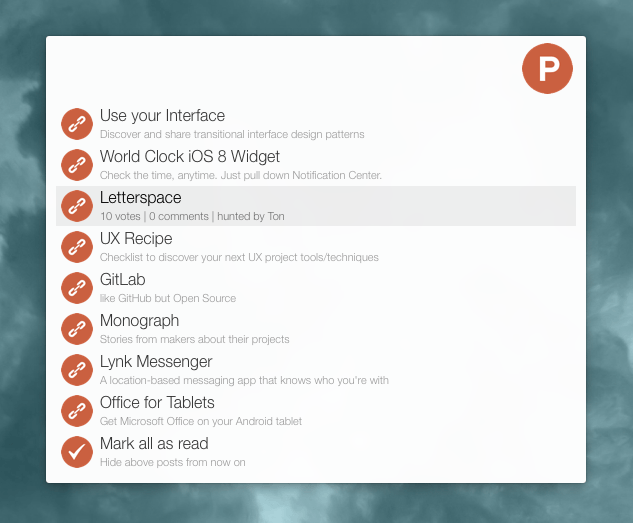

# Product Hunt Workflow for Alfred

A workflow for Alfred 2 to get today's hunts from Product Hunt.

### Features

* List all posts from today sorted by popularity
    - `⏎` to open product website in default browser
    - `⌘` to display product metadata (votes, comments, hunter)
    - `⌘ + ⏎` to open product page on Product Hunt website
* Mark posts as read (they will be hidden from now on)
    - `⏎` to hide all visible posts
    - `⌘ + ⏎` to restore posts from today
* Workflow auto-update mechanism
* Client and server-side caching for fast display

### About

* The workflow is written in Python and uses the [alfred-workflow](https://github.com/deanishe/alfred-workflow) library.
* The proxy server is written in Node.js
* [Alfred Powerpack](http://www.alfredapp.com/powerpack/) is required.

More information: [@loris](http://twitter.com/loris).
